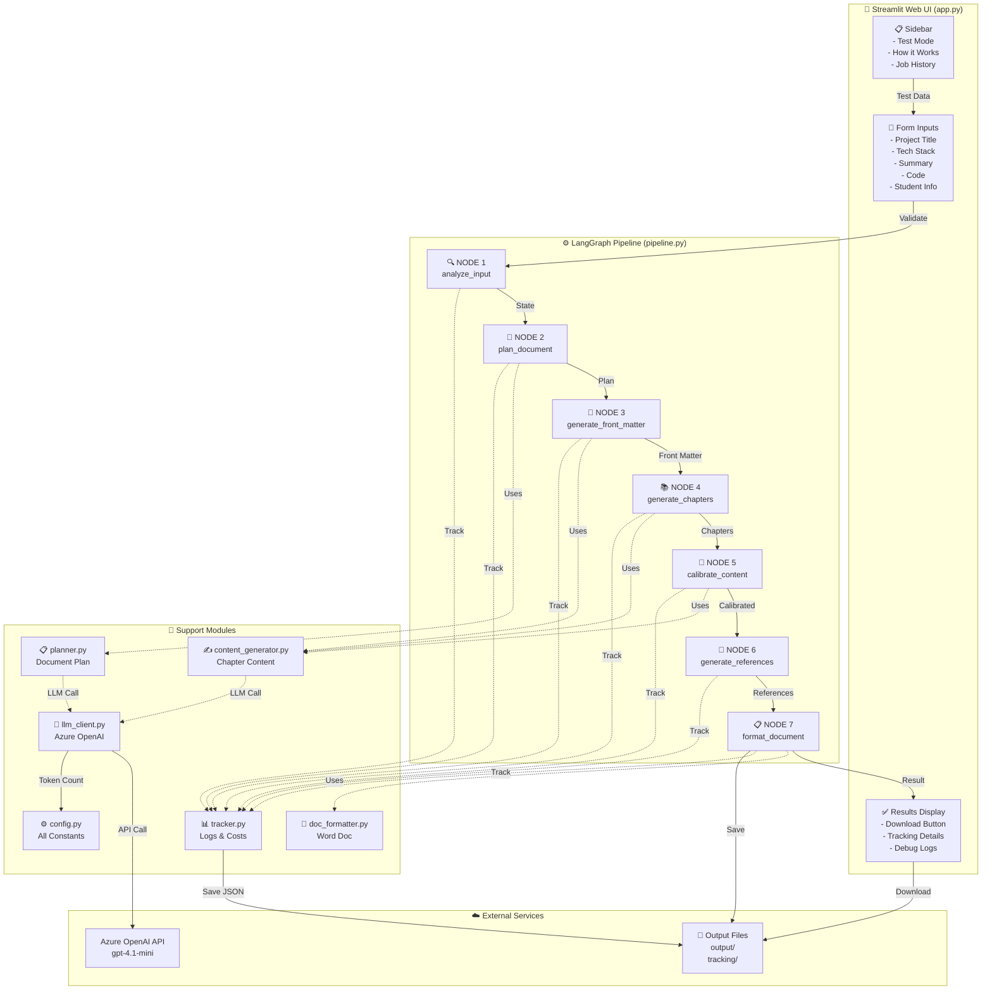
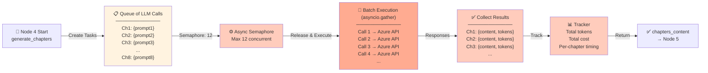
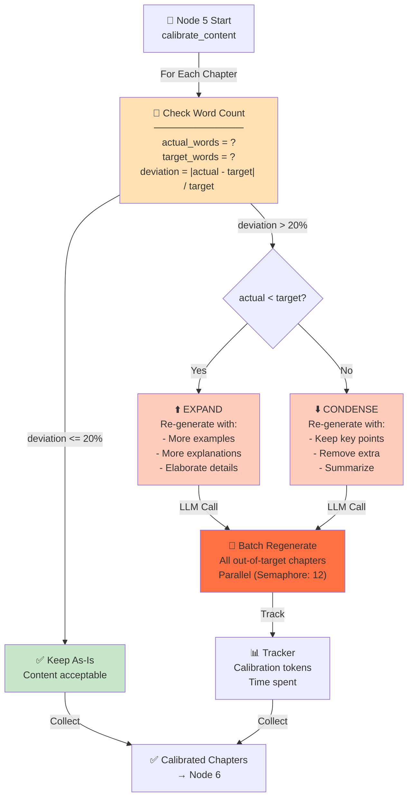
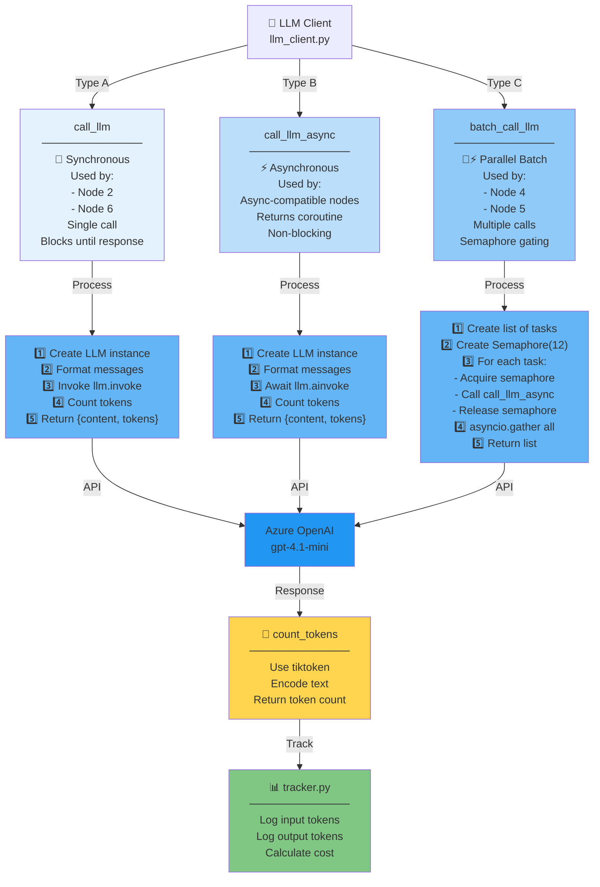
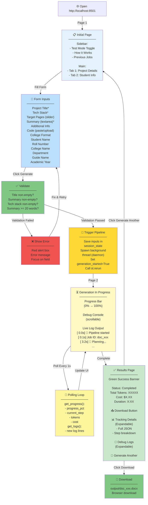
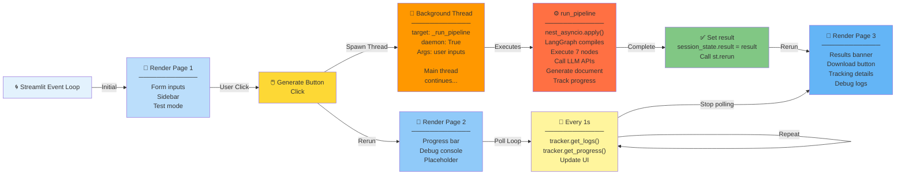

# Project Documentation Generator - Mermaid Diagrams

## 1. High-Level System Architecture



---

## 2. Pipeline Execution Flow (7-Node State Machine)

```mermaid
graph TD
    Start(["🚀 START"]) -->|Initialize State| Node1["<b>NODE 1: analyze_input</b><br/>─────────────<br/>✓ Validate inputs<br/>✓ Log metadata<br/>📊 Progress: 10%"]

    Node1 -->|PipelineState| Node2["<b>NODE 2: plan_document</b><br/>─────────────<br/>🤖 1 LLM Call<br/>📋 Output: Document Plan<br/>- Chapters<br/>- Page allocation<br/>- Word targets<br/>📊 Progress: 25%"]

    Node2 -->|document_plan| Node3["<b>NODE 3: generate_front_matter</b><br/>─────────────<br/>🤖 2 LLM Calls<br/>✓ Abstract 250-300 words<br/>✓ Acknowledgment 200-250<br/>📊 Progress: 35%"]

    Node3 -->|front_matter| Node4["<b>NODE 4: generate_chapters</b><br/>─────────────<br/>🤖 N LLM Calls Parallel<br/>⚡ Concurrency: 12<br/>✓ 1 call per chapter<br/>✓ Typical: 6-10 chapters<br/>📊 Progress: 70%"]

    Node4 -->|chapters_content| Node5["<b>NODE 5: calibrate_content</b><br/>─────────────<br/>📏 Check word count deviation<br/>⚠️ If deviation > 20%<br/>  → Re-generate chapter<br/>🤖 0-N LLM Calls (parallel)<br/>📊 Progress: 80%"]

    Node5 -->|calibrated_chapters| Node6["<b>NODE 6: generate_references</b><br/>─────────────<br/>🤖 1 LLM Call<br/>📚 Output: 15-25 References<br/>📋 Format: IEEE<br/>📊 Progress: 85%"]

    Node6 -->|references_content| Node7["<b>NODE 7: format_document</b><br/>─────────────<br/>📄 Assemble .docx file<br/>✓ Title page<br/>✓ Certificate<br/>✓ TOC, LOF, LOT<br/>✓ All chapters (parsed MD)<br/>✓ References<br/>✓ Appendix<br/>✓ Page numbers<br/>📊 Progress: 100%"]

    Node7 -->|output_file| End(["✅ END<br/>Return Result"])

    style Node1 fill:#e1f5e1
    style Node2 fill:#e3f2fd
    style Node3 fill:#f3e5f5
    style Node4 fill:#fff3e0
    style Node5 fill:#fce4ec
    style Node6 fill:#e0f2f1
    style Node7 fill:#f1f8e9
```



---

## 3. LLM Parallel Batch Processing (Node 4)



---

## 4. Content Calibration Loop (Node 5)



---

## 5. Word Document Assembly (Node 7)

```mermaid
graph TD
    Start["🚀 Node 7 Start<br/>format_document"]

    Start -->|Init| DocInit["📋 DocumentFormatter<br/>─────────────<br/>✓ Create Document<br/>✓ Setup A4 page<br/>✓ Setup styles<br/>✓ Setup margins"]

    DocInit -->|Section 1| TitlePage["📑 add_title_page<br/>─────────────<br/>College Name<br/>Department<br/>Project Title<br/>Student Info<br/>Guide Name<br/>Year"]

    TitlePage -->|Section 2| CertPage["📜 add_certificate_page<br/>─────────────<br/>Formal Certificate<br/>Signature Table<br/>3 Sign Lines"]

    CertPage -->|Section 3| Ack["📝 add_acknowledgment<br/>─────────────<br/>LLM-generated (200-250 words)"]

    Ack -->|Section 4| Abs["📄 add_abstract<br/>─────────────<br/>LLM-generated (250-300 words)"]

    Abs -->|Section 5| TOC["📑 add_table_of_contents<br/>─────────────<br/>Word field code<br/>(auto-populate on update)"]

    TOC -->|Section 6| LOF["📊 add_list_of_figures<br/>─────────────<br/>Placeholder page"]

    LOF -->|Section 7| LOT["📊 add_list_of_tables<br/>─────────────<br/>Placeholder page"]

    LOT -->|Section 8| Chapters["📚 add_chapter N times<br/>─────────────<br/>For each chapter:<br/>✓ Parse markdown<br/>✓ Handle headings<br/>✓ Handle code blocks<br/>✓ Handle diagrams<br/>✓ Handle tables"]

    Chapters -->|Parse Content| Parse["🔍 _parse_and_add_content<br/>─────────────<br/>## Heading 2 → Heading 2 style<br/>### Heading 3 → Heading 3 style<br/>```code``` → Gray table<br/>[DIAGRAM] → Bordered box<br/>| table | → Word table<br/>**bold** → Bold run<br/>*italic* → Italic run"]

    Parse -->|Section 9| Refs["📖 add_references<br/>─────────────<br/>15-25 IEEE refs"]

    Refs -->|Section 10| Appendix["📎 add_appendix<br/>─────────────<br/>Source code<br/>First 10,000 chars"]

    Appendix -->|Footer| PageNum["🔢 add_page_numbers<br/>─────────────<br/>Insert PAGE field<br/>in footer"]

    PageNum -->|Save| Save["💾 save<br/>─────────────<br/>output/<br/>doc_YYYYMMDD_HHMMSS.docx"]

    Save -->|Return| End["✅ output_file path<br/>→ Node COMPLETE"]

    style DocInit fill:#e3f2fd
    style TitlePage fill:#f3e5f5
    style CertPage fill:#f3e5f5
    style Ack fill:#e8f5e9
    style Abs fill:#e8f5e9
    style TOC fill:#fff3e0
    style LOF fill:#fff3e0
    style LOT fill:#fff3e0
    style Chapters fill:#fce4ec
    style Parse fill:#ffccbc
    style Refs fill:#f1f8e9
    style Appendix fill:#f1f8e9
    style PageNum fill:#c8e6c9
    style Save fill:#81c784
```



---

## 6. LLM Client - Sync vs Async vs Batch



---

## 7. Streamlit UI - User Interaction Flow



---

## 8. Async Threading Model



---

## 9. Tracking & Cost Estimation

```mermaid
graph TD
    Start["📊 Tracking System<br/>tracker.py"]

    Start -->|Initialize| Init["🆕 ProcessTracker<br/>─────────────<br/>job_id<br/>start_time<br/>Empty logs[]<br/>Empty steps[]<br/>Empty errors[]"]

    Init -->|Node 1| N1["Node 1: analyze_input<br/>─────────────<br/>start_step()<br/>complete_step<br/>tokens: {in:0, out:0}<br/>duration: 0.01s"]

    N1 -->|Node 2| N2["Node 2: plan_document<br/>─────────────<br/>start_step()<br/>LLM Call<br/>input_tokens: 10K<br/>output_tokens: 4K<br/>duration: 5.2s<br/>complete_step()"]

    N2 -->|Node 3-7| Nodes["Node 3-7...<br/>─────────────<br/>Same pattern<br/>Track tokens<br/>Track timing<br/>Track LLM calls"]

    Nodes -->|Aggregate| Total["📈 Totals<br/>─────────────<br/>Total input: 127K<br/>Total output: 85K<br/>Total tokens: 212K<br/>Total LLM calls: 15<br/>Total duration: 186s"]

    Total -->|Calculate Cost| Cost["💰 Cost Estimation<br/>─────────────<br/>Input: 127K × $2.50/1M<br/>       = $0.3175<br/>Output: 85K × $10/1M<br/>        = $0.85<br/>TOTAL: ~$1.17<br/><br/>Pricing Model:<br/>GPT-4o Approximation"]

    Cost -->|Persist| JSON["💾 Save JSON<br/>─────────────<br/>tracking/<br/>doc_20260212_232509.json<br/><br/>{<br/>  job_id,<br/>  status,<br/>  steps[],<br/>  total_tokens,<br/>  cost_estimate_usd,<br/>  user_inputs,<br/>  document_plan,<br/>  errors[]<br/>}"]

    JSON -->|Display| UI["🎨 Show in UI<br/>─────────────<br/>Results banner<br/>Tracking details<br/>expandable"]

    style Init fill:#e8f5e9
    style N1 fill:#fff9c4
    style N2 fill:#ffe0b2
    style Nodes fill:#ffccbc
    style Total fill:#b2dfdb
    style Cost fill:#c8e6c9
    style JSON fill:#d1c4e9
    style UI fill:#bbdefb
```



---

## 10. Complete End-to-End Flow

```mermaid
graph TD
    A["👤 User Opens App<br/>http://localhost:8501"]

    B["📋 Streamlit UI Renders<br/>Form + Sidebar"]

    C{["Enable Test Mode?"]}

    D["🧪 Auto-fill<br/>Sample Data"]

    E["📝 User Fills Form<br/>Project Details<br/>Student Info"]

    C -->|Yes| D
    C -->|No| E
    D --> F
    E --> F

    F["🖱️ Click Generate<br/>Button"]

    G["✅ Validate Inputs<br/>Non-empty check<br/>Word count check"]

    H{["Valid?"]}

    I["❌ Show Error<br/>Highlight field"]

    H -->|No| I
    I -->|Fix| F
    H -->|Yes| J

    J["🚀 Spawn Background Thread<br/>Trigger st.rerun"]

    K["⏳ Page 2: Progress Display<br/>Progress bar<br/>Debug console"]

    L["⚙️ LangGraph Pipeline<br/>7-Node State Machine<br/>Starting..."]

    M["🔄 Poll Loop<br/>Every 1 second<br/>Update UI"]

    N["🤖 Node 1-2: Planning<br/>Analyze input<br/>Plan document"]

    O["📄 Node 3: Front Matter<br/>Generate Abstract<br/>Generate Acknowledgment"]

    P["📚 Node 4: Chapters<br/>Parallel batch (12)<br/>Generate all chapters"]

    Q["🎯 Node 5: Calibration<br/>Check word counts<br/>Re-generate if needed"]

    R["📖 Node 6: References<br/>Generate IEEE refs"]

    S["📋 Node 7: Format<br/>Assemble .docx<br/>Parse markdown"]

    T["✅ Pipeline Complete<br/>Return result<br/>Trigger st.rerun"]

    U["✅ Page 3: Results<br/>Success banner<br/>Download button<br/>Tracking details<br/>Debug logs"]

    V["💾 Download .docx<br/>output/doc_xxx.docx"]

    W["✔️ Success<br/>Open in Word<br/>Update TOC<br/>Edit as needed"]

    A --> B
    B --> C
    F --> G
    G --> H
    J --> K
    K --> L
    L --> M
    L --> N
    N --> O
    O --> P
    P --> Q
    Q --> R
    R --> S
    S --> T
    M -->|Poll| M
    T --> U
    U --> V
    V --> W

    style A fill:#e3f2fd
    style B fill:#bbdefb
    style D fill:#fff9c4
    style E fill:#f3e5f5
    style F fill:#fdd835
    style G fill:#c8e6c9
    style H fill:#81c784
    style I fill:#ef5350
    style J fill:#ff9800
    style K fill:#ffe0b2
    style L fill:#ff7043
    style M fill:#fff59d
    style N fill:#ffccbc
    style O fill:#f8bbd0
    style P fill:#f48fb1
    style Q fill:#ec407a
    style R fill:#e91e63
    style S fill:#c2185b
    style T fill:#81c784
    style U fill:#c8e6c9
    style V fill:#a5d6a7
    style W fill:#66bb6a
```

